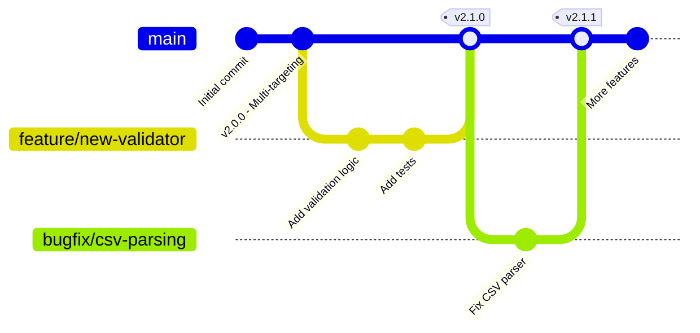
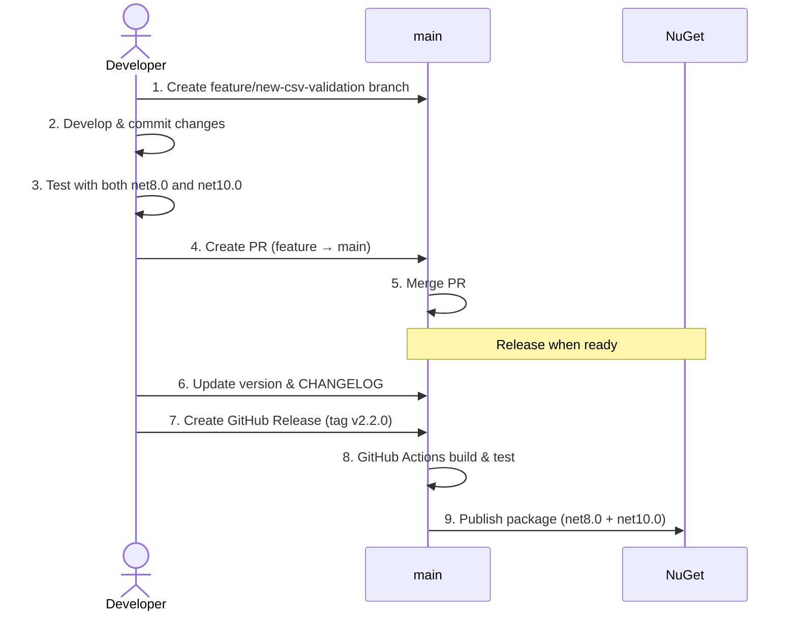
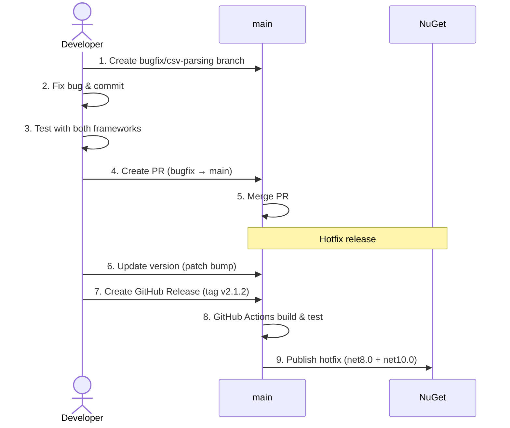
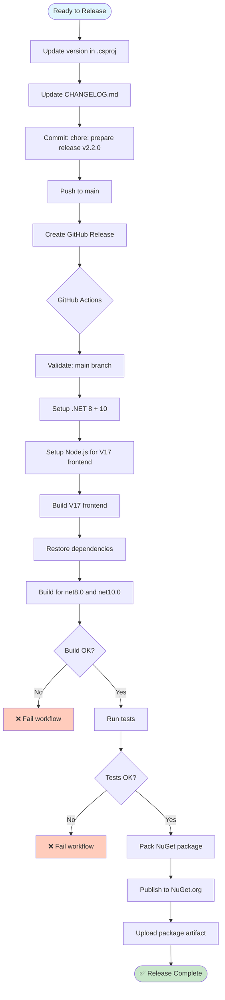
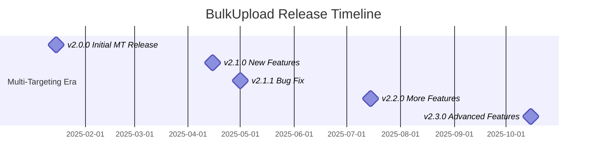
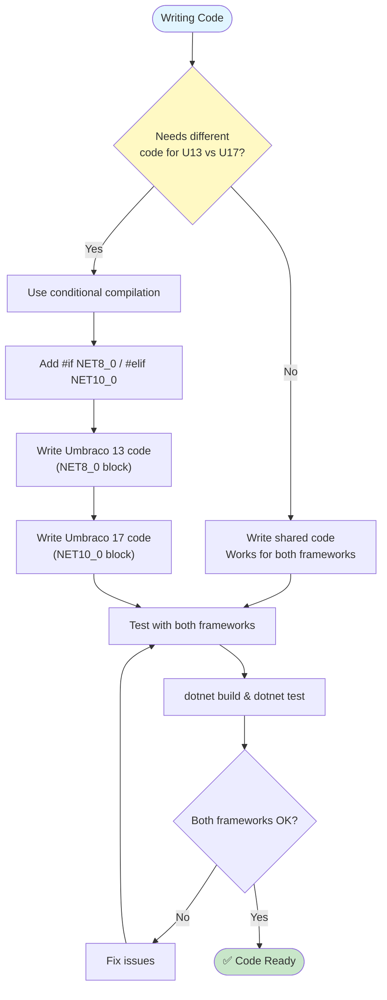
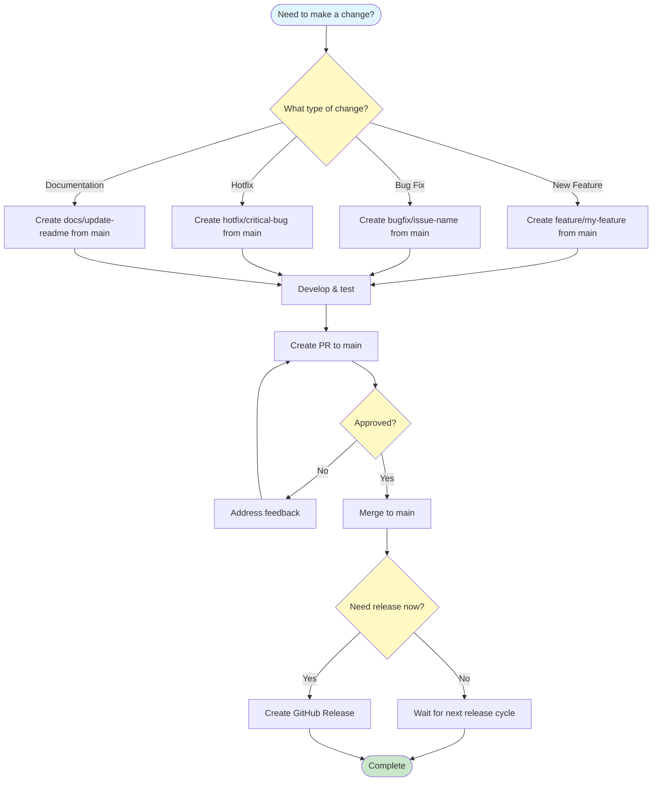
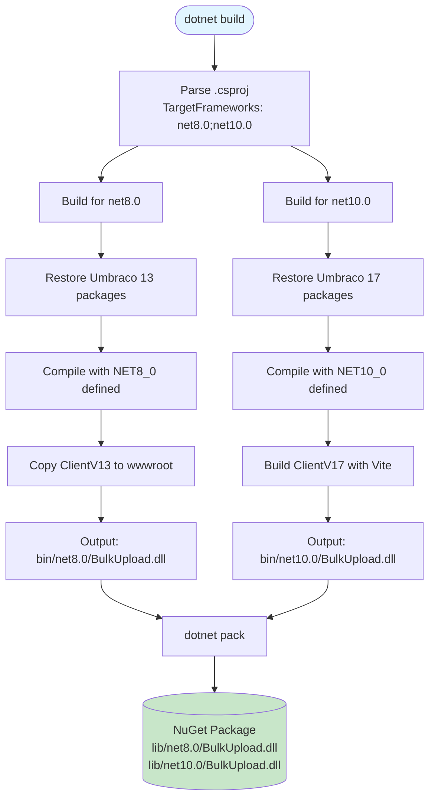

# Workflow Diagrams

This document uses [Mermaid](https://mermaid.js.org/) diagrams for better visualization. These diagrams render automatically on GitHub, GitLab, and many markdown viewers.

## Branch Structure

**Key Points:**
- `main` is the only long-lived branch
- Feature branches are created from `main` and merged back
- Releases are tagged directly on `main`
- Each release contains both net8.0 (Umbraco 13) and net10.0 (Umbraco 17)

## Feature Development Flow

**Workflow:**
1. Create feature branch from `main`
2. Develop and commit changes
3. Test with both Umbraco 13 and 17
4. Create PR targeting `main`
5. After PR is merged, feature is ready for next release
6. When ready to release, update version and create GitHub Release
7. Automated workflow publishes to NuGet

## Bug Fix Flow

**Workflow:**
1. Create bugfix branch from `main`
2. Fix the bug
3. Test with both frameworks
4. Create PR targeting `main`
5. After merge, create hotfix release if urgent
6. Bump patch version (e.g., 2.1.1 → 2.1.2)
7. Create GitHub Release to trigger automated publishing

## Release Process

**Automated Release Steps:**
1. Prepare: Update version and changelog locally
2. Commit and push to `main`
3. Create GitHub Release with tag
4. GitHub Actions automatically:
   - Validates release is from `main`
   - Builds for both frameworks
   - Runs all tests
   - Creates NuGet package
   - Publishes to NuGet.org

## Version Timeline

**Release Strategy:**
- All releases from v2.0.0+ support both Umbraco 13 and 17
- Single version number for both frameworks
- Regular feature releases (minor version bumps)
- Hotfix releases as needed (patch version bumps)

## Framework-Specific Code Handling

**Best Practice:** Minimize framework-specific code. Most business logic should work for both Umbraco versions.

## Decision Tree: What Branch Do I Use?

**Simple Rule:** All work happens in feature branches created from `main` and merged back to `main`.

## Complete Development Workflow

```mermaid
flowchart LR
    subgraph Development
        Dev[Developer] --> Feature[Create Branch<br/>from main]
        Feature --> Code[Write Code]
        Code --> LocalTest[Local Test<br/>net8.0 + net10.0]
        LocalTest --> Commit[Commit Changes<br/>Use Conventional Commits]
        Commit --> Push[Push Branch]
    end

    subgraph Review
        Push --> PR[Create Pull Request<br/>to main]
        PR --> CI[CI: Build & Test]
        CI --> CodeReview[Code Review]
        CodeReview --> Approve{Approved?}
        Approve -->|No| Code
        Approve -->|Yes| Merge[Merge PR]
    end

    subgraph Release
        Merge --> ReadyToRelease{Ready for<br/>release?}
        ReadyToRelease -->|Not yet| WaitForMore[Wait for more changes]
        ReadyToRelease -->|Yes| PrepRelease[Update version<br/>& CHANGELOG]
        PrepRelease --> CreateRelease[Create GitHub Release]
        CreateRelease --> AutomatedCI[Automated:<br/>Build, Test, Publish]
        AutomatedCI --> NuGet[(NuGet Package<br/>net8.0 + net10.0)]
    end

    style Dev fill:#e1f5ff
    style Feature fill:#fff9c4
    style Merge fill:#c8e6c9
    style NuGet fill:#ffccbc
```

**Complete Workflow:**
1. **Development**: Create branch, write code, test locally, commit, push
2. **Review**: Open PR, pass CI, get approval, merge to main
3. **Release**: When ready, update version, create GitHub Release, automated publishing

## Multi-Targeting Build Flow

**Build Process:**
- Single `dotnet build` command builds for both frameworks
- Each framework gets its own dependencies and frontend assets
- Final NuGet package contains both framework versions

---

## Viewing These Diagrams

These Mermaid diagrams render automatically on:
- ✅ GitHub
- ✅ GitLab
- ✅ Visual Studio Code (with Mermaid extension)
- ✅ Many markdown preview tools

If your viewer doesn't support Mermaid, you can:
- View on GitHub: https://github.com/ClerksWell-Ltd/BulkUpload
- Use the [Mermaid Live Editor](https://mermaid.live/)
- Install a Mermaid preview extension for your editor
