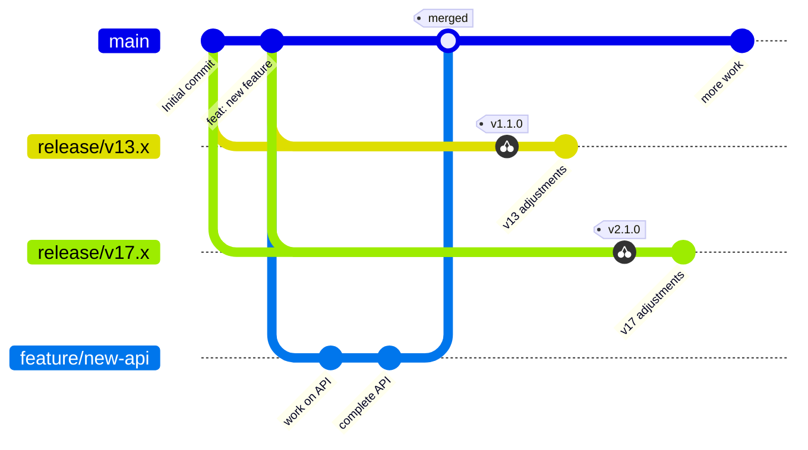
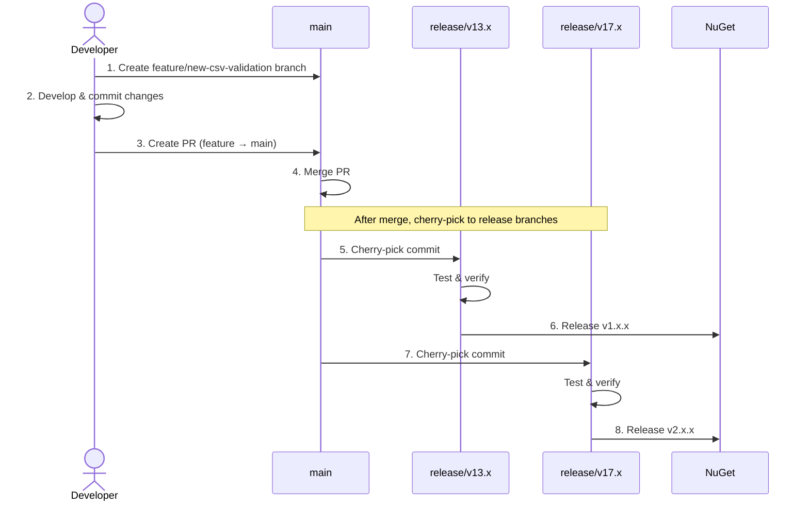
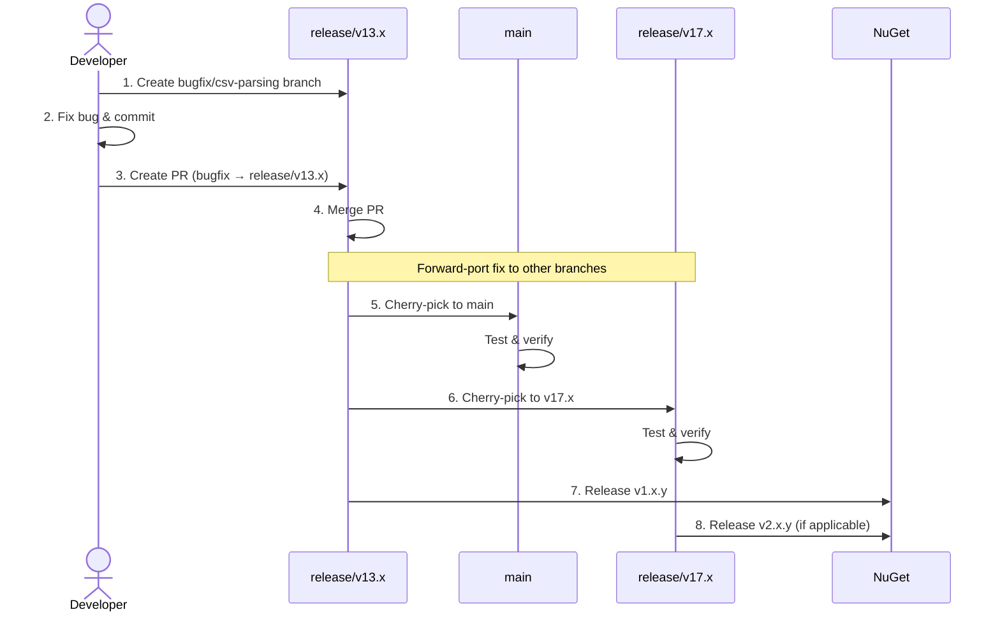
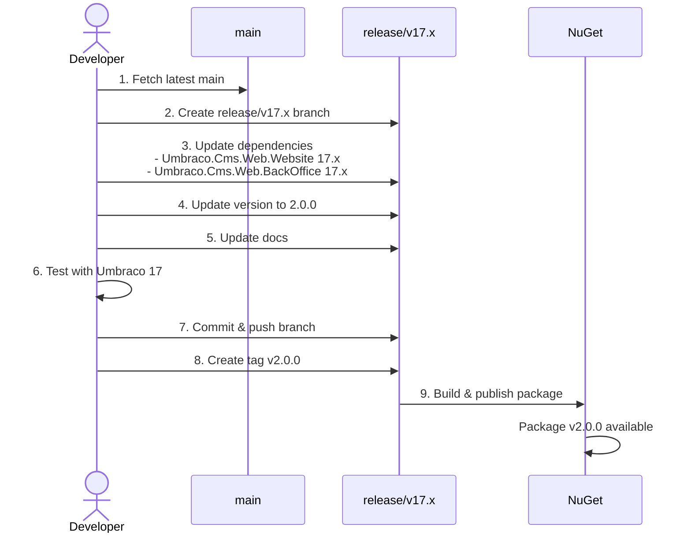
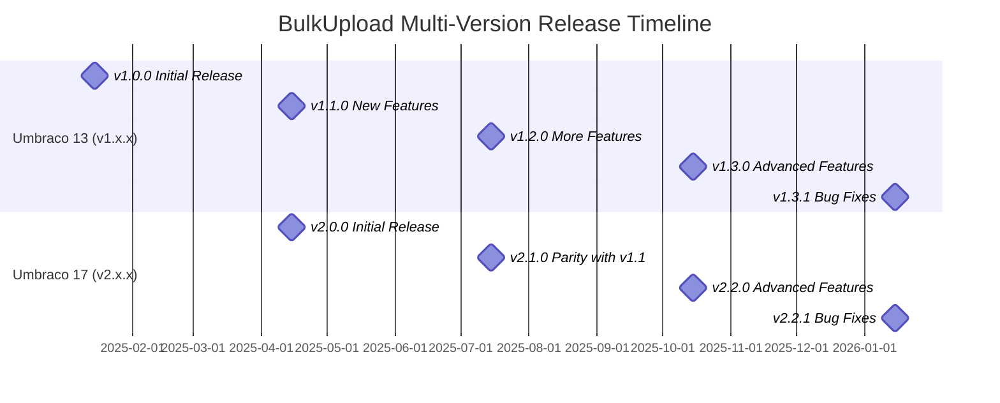
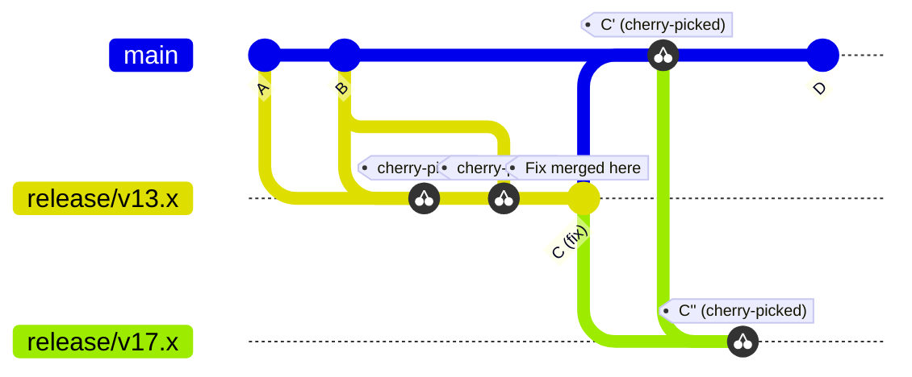
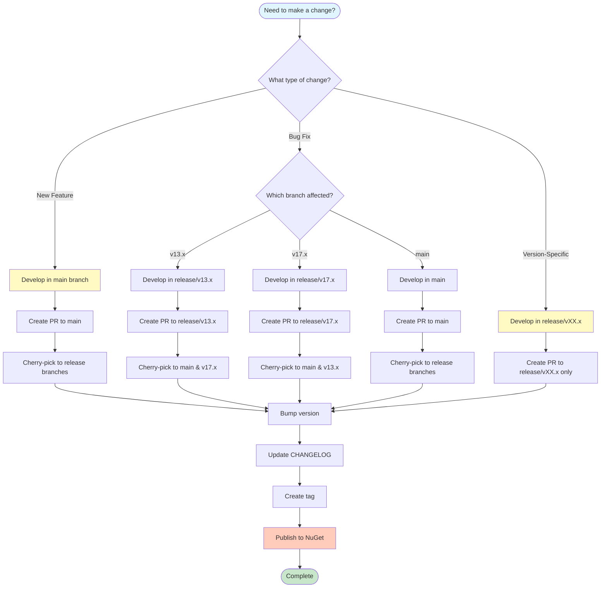
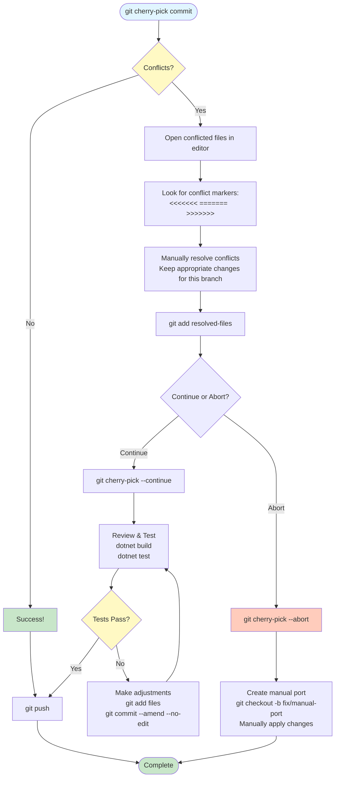

# Workflow Diagrams

This document uses [Mermaid](https://mermaid.js.org/) diagrams for better visualization. These diagrams render automatically on GitHub, GitLab, and many markdown viewers.

## Branch Structure



**Key Points:**
- `main` is the source of truth for new development
- Feature branches merge into `main`
- Changes are cherry-picked to `release/v13.x` and `release/v17.x`
- Each release branch maintains its own version numbers

## Feature Development Flow



**Workflow:**
1. Create feature branch from `main`
2. Develop and commit changes
3. Create PR targeting `main`
4. After PR is merged, cherry-pick to release branches
5. Test cherry-picked changes in each version
6. Release new versions

## Bug Fix Flow (Version-Specific)



**Workflow:**
1. Create bugfix branch from affected release branch
2. Fix the bug
3. Create PR targeting the release branch
4. After merge, cherry-pick to `main` and other release branches
5. Release patch version

## New Umbraco Version Support Flow



**Workflow:**
1. Branch `release/v17.x` from `main`
2. Update all Umbraco dependencies to version 17
3. Update package version to 2.0.0
4. Update documentation
5. Thoroughly test with Umbraco 17
6. Push branch and create initial release

## Version Timeline



**Release Strategy:**
- **v1.x.x**: Umbraco 13 support (ongoing)
- **v2.x.x**: Umbraco 17 support (starts Q2 2025)
- Features developed in `main` are cherry-picked to both versions
- Each version releases independently based on need

## Cherry-Pick Workflow



**Understanding Cherry-Pick:**
- Same fix, different commit hashes
- Commit `C` in `release/v13.x` becomes:
  - Commit `C'` in `main`
  - Commit `C''` in `release/v17.x`
- All contain the same logical changes

## Release Decision Tree



**Decision Guide:**
1. **New Feature** → Develop in `main`, cherry-pick to releases
2. **Bug Fix** → Fix in affected branch, forward-port to others
3. **Version-Specific** → Develop in specific release branch only

## Conflict Resolution Flow



**Conflict Resolution Steps:**
1. Run `git cherry-pick <commit-hash>`
2. If conflicts occur:
   - Open files and look for `<<<<<<<`, `=======`, `>>>>>>>` markers
   - Resolve conflicts manually
   - Stage files with `git add`
   - Continue with `git cherry-pick --continue`
3. Test the changes
4. If tests pass, push
5. If you can't resolve, abort and manually port the changes

## Complete Development Workflow

```mermaid
flowchart LR
    subgraph Development
        Dev[Developer] --> Feature[Create Feature Branch<br/>from main or release/vXX.x]
        Feature --> Code[Write Code]
        Code --> Commit[Commit Changes<br/>Use Conventional Commits]
        Commit --> Push[Push Branch]
    end

    subgraph Review
        Push --> PR[Create Pull Request]
        PR --> Review[Code Review]
        Review --> Approve{Approved?}
        Approve -->|No| Code
        Approve -->|Yes| Merge[Merge PR]
    end

    subgraph Distribution
        Merge --> Cherry[Cherry-pick to<br/>other branches if needed]
        Cherry --> Test[Test in each version]
        Test --> Release[Release new version]
        Release --> NuGet[(NuGet Package)]
    end

    style Dev fill:#e1f5ff
    style Feature fill:#fff9c4
    style Merge fill:#c8e6c9
    style NuGet fill:#ffccbc
```

**Complete Workflow:**
1. **Development**: Create branch, write code, commit, push
2. **Review**: Open PR, get approval, merge
3. **Distribution**: Cherry-pick as needed, test, release

---

## Viewing These Diagrams

These Mermaid diagrams render automatically on:
- ✅ GitHub
- ✅ GitLab
- ✅ Visual Studio Code (with Mermaid extension)
- ✅ Many markdown preview tools

If your viewer doesn't support Mermaid, you can:
- View on GitHub: https://github.com/ClerksWell-Ltd/BulkUpload
- Use the [Mermaid Live Editor](https://mermaid.live/)
- Install a Mermaid preview extension for your editor
