# BulkUpload Process Diagrams

Visual guides to understand how BulkUpload processes imports.

## Table of Contents

- [Content Import Process](#content-import-process)
- [Media Import Process](#media-import-process)
- [Multi-CSV Import Process](#multi-csv-import-process)
- [Hierarchy Resolution Process](#hierarchy-resolution-process)
- [Media Deduplication Process](#media-deduplication-process)

---

## Content Import Process

### Single CSV Content Import


### CSV with ZIP Media Import


---

## Media Import Process

### Single CSV Media Import


### Media Type Auto-Detection


---

## Multi-CSV Import Process

### Multi-CSV with Deduplication


### Media Deduplication Logic


---

## Hierarchy Resolution Process

### Legacy Hierarchy Mapping


### Topological Sort for Dependencies


---

## Media Deduplication Process

### Cross-CSV Media Deduplication

```mermaid
flowchart TD
    Start([Multiple CSV files]) --> InitCache[Initialize global<br/>media cache]
    InitCache --> CSV1[Process CSV 1]

    CSV1 --> Row1[Row references<br/>logo.jpg]
    Row1 --> Check1{logo.jpg<br/>in cache?}
    Check1 -->|No| Create1[Create media item]
    Create1 --> Cache1[Add to cache:<br/>logo.jpg → GUID-ABC]
    Cache1 --> Result1[Result: GUID-ABC]

    Result1 --> CSV2[Process CSV 2]
    CSV2 --> Row2[Row references<br/>logo.jpg]
    Row2 --> Check2{logo.jpg<br/>in cache?}
    Check2 -->|Yes| Reuse1[Reuse cached GUID-ABC]
    Reuse1 --> Result2[Result: GUID-ABC<br/>same as CSV 1]

    Result2 --> CSV3[Process CSV 3]
    CSV3 --> Row3[Row references<br/>LOGO.JPG<br/>case-insensitive]
    Row3 --> Normalize[Normalize to<br/>logo.jpg]
    Normalize --> Check3{logo.jpg<br/>in cache?}
    Check3 -->|Yes| Reuse2[Reuse cached GUID-ABC]
    Reuse2 --> Result3[Result: GUID-ABC<br/>same as CSV 1 & 2]

    Result3 --> Summary[Summary]
    Summary --> Count[1 media item created<br/>3 rows reference it<br/>2 deduplications saved]
```



---

## Resolver Pipeline

### Value Transformation Process

```mermaid
flowchart TD
    Start([CSV column value]) --> ParseHeader[Parse column header<br/>property|resolver]
    ParseHeader --> HasResolver{Resolver<br/>specified?}

    HasResolver -->|No| DefaultResolver[Use default text resolver]
    HasResolver -->|Yes| FindResolver[Find resolver by alias]

    FindResolver --> ResolverFound{Resolver<br/>registered?}
    ResolverFound -->|No| Error[Error: Resolver not found]
    ResolverFound -->|Yes| CallResolver[Call resolver.Resolve value]

    DefaultResolver --> Transform[Transform value]
    CallResolver --> Transform

    Transform --> Examples{Example<br/>transformations}
    Examples -->|dateTime| ISO8601[Convert to ISO 8601<br/>2024-01-15T00:00:00]
    Examples -->|boolean| TrueFalse[Convert to true/false]
    Examples -->|stringArray| SplitArray[Split by comma<br/>to array]
    Examples -->|zipFileToMedia| CreateMedia[Create media from ZIP<br/>return UDI]
    Examples -->|guidToMediaUdi| ConvertUDI[Convert GUID to<br/>umb://media/guid]

    ISO8601 --> SetProperty[Set property value]
    TrueFalse --> SetProperty
    SplitArray --> SetProperty
    CreateMedia --> SetProperty
    ConvertUDI --> SetProperty

    SetProperty --> Success([Property set])
    Error --> End([Skip this property])
```

---

## Error Handling Flow

### Import Error Handling


---

## Notes

- All diagrams use the Mermaid.js syntax for rendering in GitHub and most markdown viewers
- These processes are simplified for clarity; actual implementation includes additional validation and error handling
- For detailed code-level documentation, see the source code in `src/BulkUpload/Services/`
