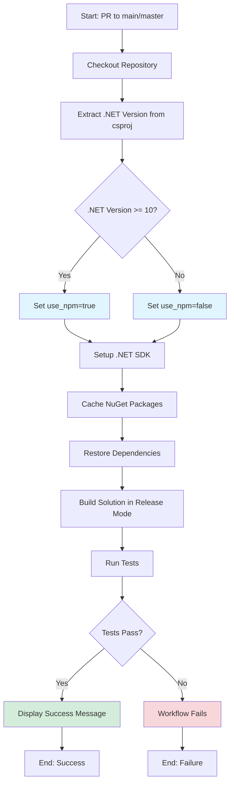

# Build Workflow Documentation

## Overview

The **Build** workflow ensures code quality by running automated builds and tests on all pull requests targeting the `main` or `master` branches. It can also be triggered manually via workflow dispatch.

## Trigger Events

- **Pull Requests**: Automatically runs when a PR is opened or updated targeting `main` or `master` branches
- **Manual Trigger**: Can be manually triggered via GitHub Actions UI using `workflow_dispatch`

## Workflow Steps

## Detailed Step Breakdown

### 1. Checkout Repository
- **Action**: `actions/checkout@v4`
- **Purpose**: Clones the repository code to the runner

### 2. Extract .NET Version
- **Type**: Shell script
- **Purpose**: Dynamically detects the .NET version from `BulkUpload.csproj`
- **Logic**:
  - Parses `TargetFramework` tag (e.g., `net8.0` → `8`)
  - Sets `use_npm` flag to `true` if .NET version ≥ 10 (for Umbraco 17+)
  - Outputs version for later steps

### 3. Setup .NET
- **Action**: `actions/setup-dotnet@v4`
- **Purpose**: Installs the detected .NET SDK version
- **Dynamic Version**: Uses extracted version from step 2

### 4. Cache NuGet Packages
- **Action**: `actions/cache@v4`
- **Purpose**: Speeds up builds by caching NuGet packages
- **Cache Key**: Based on OS and hash of `packages.lock.json` and `.csproj` files
- **Restore Keys**: Falls back to OS-specific NuGet cache

### 5. Restore Dependencies
- **Command**: `dotnet restore`
- **Options**:
  - `--disable-parallel`: Ensures stable restoration
  - Target: `src/BulkUpload.sln`

### 6. Build Solution
- **Command**: `dotnet build`
- **Configuration**: Release
- **Options**:
  - `--no-restore`: Skips restore (already done)
  - `-p:SkipPreBuild=true`: Skips pre-build tasks

### 7. NPM Steps (Conditional - Currently Commented Out)
*These steps are prepared for .NET 10+ / Umbraco 17+ support:*
- Setup Node.js 20.x
- Install npm dependencies (`npm ci`)
- Build npm package (`npm run build`)

### 8. Run Tests
- **Command**: `dotnet test`
- **Configuration**: Release
- **Options**:
  - `--no-build`: Uses already built assemblies
  - `--verbosity normal`: Standard output detail

### 9. Display Build Status
- **Condition**: Only runs if all previous steps succeed
- **Output**: Success confirmation message

## Environment

- **Runner**: `ubuntu-latest`
- **Default .NET Version**: Dynamically detected from project
- **Node.js Version**: 20.x (when npm is enabled)

## Configuration Files Used

- `src/BulkUpload.sln` - Solution file
- `src/BulkUpload/BulkUpload.csproj` - Project file (version detection)
- `packages.lock.json` - NuGet package lock file (for caching)

## Future Enhancements

The workflow includes commented-out npm support that can be enabled when:
- Upgrading to .NET 10+ / Umbraco 17+
- Frontend build steps are needed
- Simply uncomment the npm-related steps (lines 54-68)

## Success Criteria

The workflow succeeds when:
1. Code builds without errors in Release configuration
2. All tests pass
3. No dependency restoration issues occur

## Workflow File

Location: `.github/workflows/build.yml`
