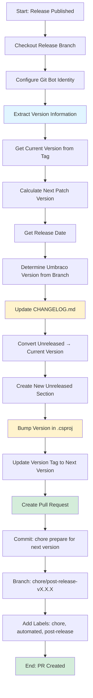
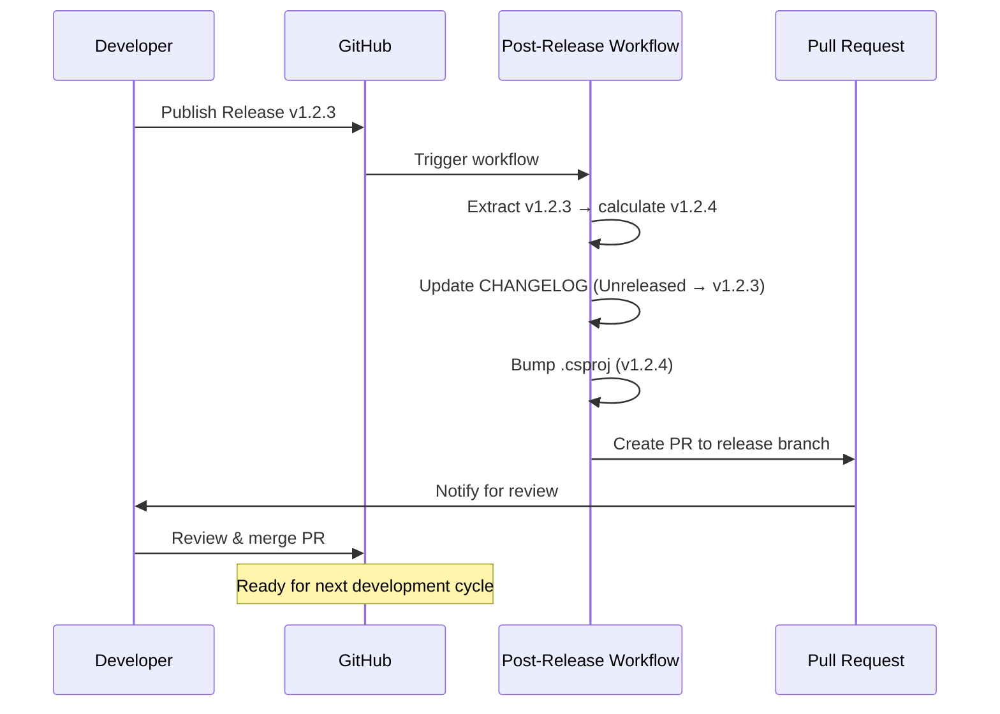

# Post-Release Automation Workflow Documentation

## Overview

The **Post-Release Automation** workflow handles housekeeping tasks after a release is published. It automatically updates the changelog, bumps the version number for the next development cycle, and creates a pull request with these changes.

## Trigger Events

- **Release Published**: Automatically runs when a GitHub release is published

## Workflow Steps



## Detailed Step Breakdown

### 1. Checkout Release Branch
- **Action**: `actions/checkout@v4`
- **Purpose**: Checks out the branch from which the release was created
- **Options**:
  - `ref`: Uses the release's target commitish (release branch)
  - `fetch-depth: 0`: Full git history for proper versioning
  - `token`: GitHub Actions token for authentication

### 2. Configure Git
- **Type**: Shell script
- **Purpose**: Sets up git identity for automated commits
- **Identity**: `github-actions[bot]`

### 3. Extract Version Information
- **Type**: Shell script
- **Purpose**: Calculates all version-related data needed for updates
- **Outputs**:
  - `current`: Current version from release tag (e.g., `1.2.3`)
  - `next`: Next patch version (e.g., `1.2.4`)
  - `date`: Release date in YYYY-MM-DD format
  - `branch`: The release branch name
  - `umbraco`: Umbraco version (13 or 17) based on branch name

**Version Calculation Logic**:
```
Input:  v1.2.3
Remove: v prefix → 1.2.3
Parse:  Major=1, Minor=2, Patch=3
Next:   1.2.(3+1) → 1.2.4
```

**Umbraco Detection**:
- `release/v13.x` → Umbraco 13
- `release/v17.x` → Umbraco 17
- Other branches → Unknown

### 4. Update CHANGELOG.md
- **Type**: AWK script
- **Purpose**: Transforms the changelog for the new release
- **Changes**:
  1. Finds `## [Unreleased]` section
  2. Preserves the Unreleased header
  3. Adds fresh subsections (Added, Changed, Fixed)
  4. Inserts new release section: `## [X.X.X] - YYYY-MM-DD (Umbraco XX)`
  5. Keeps existing content below

**Before**:
```markdown
## [Unreleased]

### Added
- Some feature

## [1.0.0] - 2024-01-01
```

**After**:
```markdown
## [Unreleased]

### Added

### Changed

### Fixed

## [1.2.3] - 2025-12-20 (Umbraco 13)

### Added
- Some feature

## [1.0.0] - 2024-01-01
```

### 5. Bump Version in .csproj
- **Type**: sed command
- **Purpose**: Updates the version number in the project file
- **Target**: `src/BulkUpload/BulkUpload.csproj`
- **Change**: `<Version>1.2.3</Version>` → `<Version>1.2.4</Version>`

### 6. Create Pull Request
- **Action**: `peter-evans/create-pull-request@v6`
- **Purpose**: Automatically creates a PR with all changes

**PR Details**:
- **Branch**: `chore/post-release-v{current_version}`
- **Base**: The release branch (e.g., `release/v13.x`)
- **Title**: `chore: post-release cleanup for v{current_version}`
- **Labels**: `chore`, `automated`, `post-release`
- **Commit Message**: Descriptive multi-line message explaining changes

**PR Body Includes**:
- Release version information
- Checklist of completed changes
- Next steps for maintainers
- Link to branching strategy documentation
- Automation indicator

## Version Flow Diagram



## Environment

- **Runner**: `ubuntu-latest`
- **Git Identity**: `github-actions[bot]`
- **Token**: `GITHUB_TOKEN` (automatic)

## Files Modified

1. `CHANGELOG.md` - Updated with release info and fresh Unreleased section
2. `src/BulkUpload/BulkUpload.csproj` - Version bumped to next patch version

## Integration Points

- **Triggered By**: Release workflow completing successfully
- **Creates**: Pull request that must be manually reviewed and merged
- **References**: Branching strategy documentation for cross-branch releases

## Next Steps After Workflow

1. Review the automatically created PR
2. Verify changelog accuracy
3. Confirm version bump is correct
4. Merge the PR to complete the release cycle
5. If needed, cherry-pick the release to other branches (see branching strategy)

## Workflow File

Location: `.github/workflows/post-release.yml`

## Related Workflows

- `release.yml` - Triggers this workflow by publishing a release
- See `docs/BRANCHING_STRATEGY.md` for release branch management
