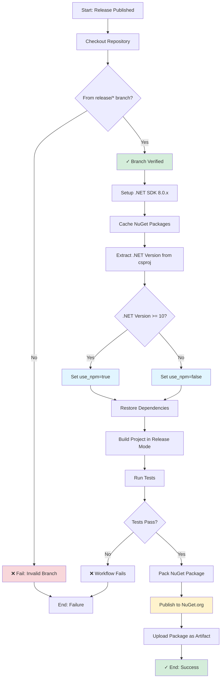
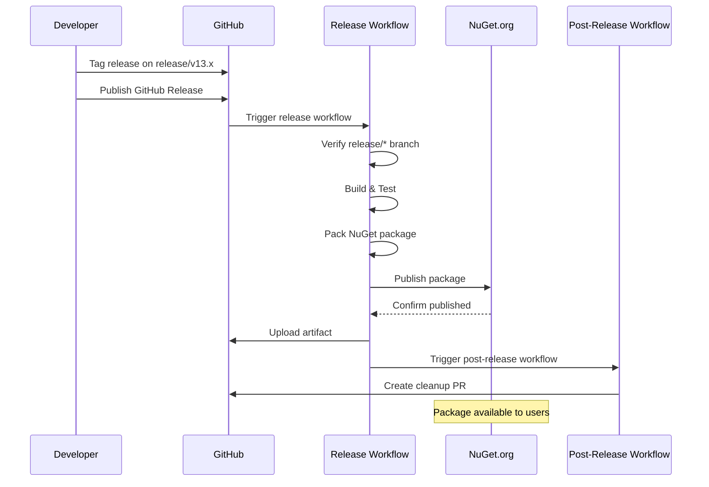
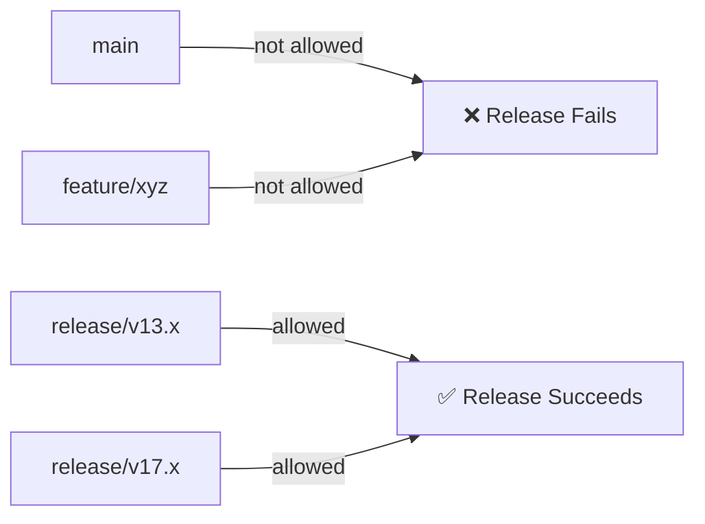

# Release to NuGet Workflow Documentation

## Overview

The **Release to NuGet** workflow handles the complete release process for publishing the BulkUpload package to NuGet.org. It builds, tests, packages, and publishes the NuGet package when a GitHub release is created from a `release/*` branch.

## Trigger Events

- **Release Published**: Automatically runs when a GitHub release is published
- **Branch Restriction**: Only executes for releases from `release/*` branches

## Workflow Steps

## Detailed Step Breakdown

### 1. Checkout Repository
- **Action**: `actions/checkout@v4`
- **Purpose**: Clones the repository at the release tag
- **Branch**: Automatically uses the release tag reference

### 2. Verify Release Branch
- **Type**: Shell script
- **Purpose**: Security check to ensure releases only come from designated release branches
- **Logic**:
  - Extracts branch name from `GITHUB_REF`
  - Checks if branch matches pattern `release/*`
  - **Fails immediately** if not a release branch
- **Valid Branches**: `release/v13.x`, `release/v17.x`, etc.
- **Invalid Branches**: `main`, `master`, `feature/*`, etc.

**Why This Matters**: Prevents accidental production releases from development branches

### 3. Setup .NET
- **Action**: `actions/setup-dotnet@v4`
- **Purpose**: Installs .NET SDK for building
- **Version**: 8.0.x (hardcoded for stability)

### 4. Cache NuGet Packages
- **Action**: `actions/cache@v4`
- **Purpose**: Speeds up builds by caching dependencies
- **Cache Key**: OS + hash of lock files and project files
- **Restore Keys**: OS-specific fallback

### 5. Extract .NET Version
- **Type**: Shell script
- **Purpose**: Detects target .NET version from project file
- **Process**:
  - Parses `TargetFramework` from `BulkUpload.csproj`
  - Example: `net8.0` → `8`
  - Sets `use_npm` flag for .NET 10+ (future Umbraco 17 support)

### 6. Restore Dependencies
- **Command**: `dotnet restore`
- **Target**: `src/BulkUpload/BulkUpload.csproj` (project-level)
- **Options**: `--disable-parallel` for stability

### 7. Build Project
- **Command**: `dotnet build`
- **Configuration**: Release
- **Options**:
  - `--no-restore`: Skip restore (already done)
  - `-p:SkipPreBuild=true`: Skip pre-build scripts

### 8. Run Tests
- **Command**: `dotnet test`
- **Target**: `src/BulkUpload.Tests/BulkUpload.Tests.csproj`
- **Configuration**: Release
- **Options**:
  - `--no-build`: Use existing build output
  - `--verbosity normal`: Standard output

**Critical**: Workflow fails if any test fails, preventing broken releases

### 9. Pack NuGet Package
- **Command**: `dotnet pack`
- **Configuration**: Release
- **Options**:
  - `--no-build`: Uses existing build
  - `--output ./artifacts`: Places .nupkg in artifacts directory
- **Output**: `BulkUpload.{version}.nupkg`

### 10. NPM Steps (Conditional - Currently Commented Out)
*Prepared for future .NET 10+ / Umbraco 17+ releases:*
- Setup Node.js 20.x (only if .NET >= 10)
- Install npm dependencies
- Build npm package

### 11. Publish to NuGet
- **Command**: `dotnet nuget push`
- **Target**: All `.nupkg` files in `./artifacts/`
- **Destination**: https://api.nuget.org/v3/index.json
- **Authentication**: Uses `NUGET_API_KEY` secret
- **Options**:
  - `--skip-duplicate`: Prevents errors if version already exists

**Security Note**: Requires `NUGET_API_KEY` secret to be configured in repository settings

### 12. Upload Package Artifact
- **Action**: `actions/upload-artifact@v4`
- **Purpose**: Archives the NuGet package in GitHub Actions
- **Artifact Name**: `nuget-package`
- **Contents**: All `.nupkg` files
- **Retention**: Default GitHub Actions retention period

## Release Flow Diagram

## Environment

- **Runner**: `ubuntu-latest`
- **.NET SDK**: 8.0.x (for build tooling)
- **Target Framework**: Dynamically detected from project
- **Node.js**: 20.x (when npm support is enabled)

## Required Secrets

| Secret | Purpose | Required |
|--------|---------|----------|
| `NUGET_API_KEY` | Authentication for publishing to NuGet.org | ✅ Yes |
| `GITHUB_TOKEN` | Automatic - for artifact upload | ✅ Auto |

## Files Used

- `src/BulkUpload/BulkUpload.csproj` - Main project file
- `src/BulkUpload.Tests/BulkUpload.Tests.csproj` - Test project
- `packages.lock.json` - NuGet dependencies (for caching)

## Artifacts Generated

1. **NuGet Package** (`BulkUpload.{version}.nupkg`)
   - Published to NuGet.org
   - Archived as GitHub Actions artifact
   - Available for 90 days (default retention)

## Branch Strategy Integration

This workflow enforces the branching strategy:

**Valid Release Branches**:
- `release/v13.x` - For Umbraco 13 releases
- `release/v17.x` - For Umbraco 17 releases (future)

## Success Criteria

The release succeeds when:
1. ✅ Release is from a `release/*` branch
2. ✅ Dependencies restore successfully
3. ✅ Project builds without errors
4. ✅ All tests pass
5. ✅ NuGet package is created
6. ✅ Package publishes to NuGet.org (or is already published)
7. ✅ Artifact is uploaded to GitHub

## Failure Scenarios

The workflow fails if:
- ❌ Release is not from a `release/*` branch
- ❌ Build errors occur
- ❌ Any test fails
- ❌ NuGet publish fails (network, authentication, etc.)

## Post-Release Integration

Upon successful completion, this workflow triggers:
- **Post-Release Workflow** - Handles version bumping and changelog updates

## Future Enhancements

**NPM Support** (commented out, ready to enable):
- Activated automatically for .NET 10+ projects
- Builds frontend assets
- Supports Umbraco 17+ requirements

To enable:
1. Uncomment lines 70-82 in `release.yml`
2. Ensure `package.json` and npm scripts are configured
3. Test on a development release first

## Manual Release Process

To create a release:

1. Ensure you're on a `release/*` branch
2. Update version in `BulkUpload.csproj`
3. Update `CHANGELOG.md`
4. Commit changes
5. Create and push a git tag: `git tag v1.2.3 && git push origin v1.2.3`
6. Go to GitHub → Releases → Draft a new release
7. Select the tag, fill in release notes
8. Click "Publish release"
9. Workflow runs automatically
10. Review post-release PR and merge

## Workflow File

Location: `.github/workflows/release.yml`

## Related Workflows

- `build.yml` - Runs tests on PRs (quality gate before merging to release branch)
- `post-release.yml` - Triggered after this workflow to update versions
