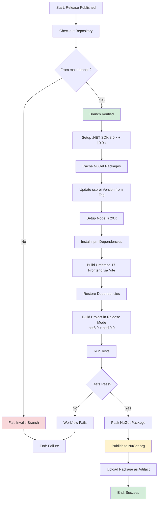
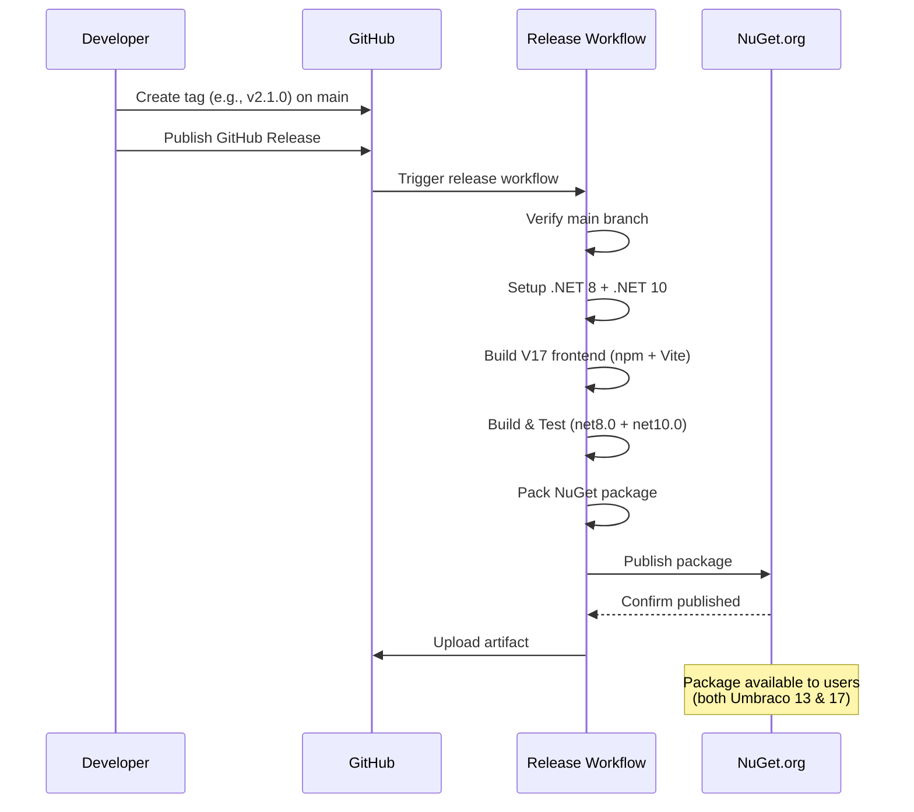
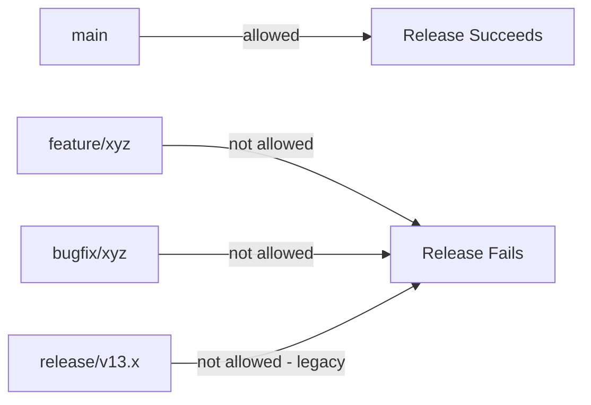

# Release to NuGet Workflow Documentation

## Overview

The **Release to NuGet** workflow handles the complete release process for publishing the BulkUpload package to NuGet.org. It builds, tests, packages, and publishes the multi-targeted NuGet package when a GitHub release is created from the `main` branch.

Starting with v2.0.0, BulkUpload uses .NET multi-targeting to produce a **single NuGet package** containing both `net8.0` (Umbraco 13) and `net10.0` (Umbraco 17) assemblies.

## Trigger Events

- **Release Published**: Automatically runs when a GitHub release is published
- **Branch Restriction**: Only executes for releases from the `main` branch

## Workflow Steps

```mermaid
flowchart TD
    A[Start: Release Published] --> B[Checkout Repository]
    B --> C{From main branch?}
    C -->|No| D[Fail: Invalid Branch]
    C -->|Yes| E[Branch Verified]
    E --> F[Setup .NET SDK 8.0.x + 10.0.x]
    F --> G[Cache NuGet Packages]
    G --> H[Update csproj Version from Tag]
    H --> I[Setup Node.js 20.x]
    I --> J[Install npm Dependencies]
    J --> K[Build Umbraco 17 Frontend via Vite]
    K --> L[Restore Dependencies]
    L --> M[Build Project in Release Mode<br/>net8.0 + net10.0]
    M --> N[Run Tests]
    N --> O{Tests Pass?}
    O -->|No| P[Workflow Fails]
    O -->|Yes| Q[Pack NuGet Package]
    Q --> R[Publish to NuGet.org]
    R --> S[Upload Package as Artifact]
    S --> T[End: Success]
    D --> U[End: Failure]
    P --> U

    style D fill:#f8d7da
    style E fill:#d4edda
    style R fill:#fff3cd
    style T fill:#d4edda
```

## Detailed Step Breakdown

### 1. Checkout Repository
- **Action**: `actions/checkout@v4`
- **Purpose**: Clones the repository at the release tag
- **Branch**: Automatically uses the release tag reference

### 2. Verify Release Branch
- **Type**: Shell script
- **Purpose**: Security check to ensure releases only come from the `main` branch
- **Logic**:
  - Reads `target_commitish` from the release event
  - Checks if branch is `main`
  - **Fails immediately** if not `main`
- **Valid Branch**: `main` only
- **Invalid Branches**: `feature/*`, `bugfix/*`, `release/*` (legacy), etc.

**Why This Matters**: v2.0.0+ uses multi-targeting from `main`, so all releases must originate from `main`.

### 3. Setup .NET SDKs
- **Action**: `actions/setup-dotnet@v4` (called twice)
- **Purpose**: Installs both .NET SDK 8.0.x and 10.0.x for multi-targeted builds
- **.NET 8**: Required for building the `net8.0` target (Umbraco 13)
- **.NET 10**: Required for building the `net10.0` target (Umbraco 17)

### 4. Cache NuGet Packages
- **Action**: `actions/cache@v4`
- **Purpose**: Speeds up builds by caching dependencies
- **Cache Key**: OS + hash of lock files and project files
- **Restore Keys**: OS-specific fallback

### 5. Update csproj Version from Release Tag
- **Type**: Shell script
- **Purpose**: Extracts version from the release tag (e.g., `v2.1.0` becomes `2.1.0`) and updates `BulkUpload.csproj`
- **Process**:
  - Strips the `v` prefix from the tag name
  - Updates `<Version>` element in the `.csproj` file via `sed`
  - Verifies the update

### 6. Setup Node.js
- **Action**: `actions/setup-node@v4`
- **Purpose**: Installs Node.js 20.x for building the Umbraco 17 Lit frontend
- **Version**: 20.x

### 7. Install npm Dependencies
- **Command**: `npm ci`
- **Working Directory**: `src/BulkUpload/ClientV17`
- **Purpose**: Clean install of frontend dependencies for the V17 Lit web components

### 8. Build Umbraco 17 Frontend
- **Command**: `npm run build`
- **Working Directory**: `src/BulkUpload/ClientV17`
- **Purpose**: Runs Vite to bundle the Lit web components into `wwwroot/bulkupload.js`

### 9. Restore Dependencies
- **Command**: `dotnet restore`
- **Target**: `src/BulkUpload.sln` (solution-level)
- **Options**: `--disable-parallel` for stability

### 10. Build Project
- **Command**: `dotnet build`
- **Configuration**: Release
- **Targets**: Builds for both `net8.0` and `net10.0` simultaneously
- **Options**:
  - `--no-restore`: Skip restore (already done)
  - `-p:SkipPreBuild=true`: Skip pre-build scripts (formatting)
- **Outputs**: Build logs with error/warning counts are written to the GitHub Step Summary

### 11. Run Tests
- **Command**: `dotnet test`
- **Target**: `src/BulkUpload.Tests/BulkUpload.Tests.csproj`
- **Configuration**: Release
- **Options**:
  - `--no-build`: Use existing build output
  - `--verbosity normal`: Standard output
- **Outputs**: Test results (passed/failed/skipped/duration) are written to the GitHub Step Summary

**Critical**: Workflow fails if any test fails, preventing broken releases.

### 12. Pack NuGet Package
- **Command**: `dotnet pack`
- **Configuration**: Release
- **Options**:
  - `--no-build`: Uses existing build
  - `--output ./artifacts`: Places .nupkg in artifacts directory
- **Output**: `Umbraco.Community.BulkUpload.{version}.nupkg` (contains both `net8.0` and `net10.0` assemblies)

### 13. Publish to NuGet
- **Command**: `dotnet nuget push`
- **Target**: All `.nupkg` files in `./artifacts/`
- **Destination**: https://api.nuget.org/v3/index.json
- **Authentication**: Uses `NUGET_API_KEY` secret
- **Options**:
  - `--skip-duplicate`: Prevents errors if version already exists

**Security Note**: Requires `NUGET_API_KEY` secret to be configured in repository settings.

### 14. Upload Package Artifact
- **Action**: `actions/upload-artifact@v4`
- **Purpose**: Archives the NuGet package in GitHub Actions
- **Artifact Name**: `nuget-package`
- **Contents**: All `.nupkg` files
- **Retention**: Default GitHub Actions retention period

## Release Flow Diagram

```mermaid
sequenceDiagram
    participant Dev as Developer
    participant GH as GitHub
    participant Workflow as Release Workflow
    participant NuGet as NuGet.org

    Dev->>GH: Create tag (e.g., v2.1.0) on main
    Dev->>GH: Publish GitHub Release
    GH->>Workflow: Trigger release workflow
    Workflow->>Workflow: Verify main branch
    Workflow->>Workflow: Setup .NET 8 + .NET 10
    Workflow->>Workflow: Build V17 frontend (npm + Vite)
    Workflow->>Workflow: Build & Test (net8.0 + net10.0)
    Workflow->>Workflow: Pack NuGet package
    Workflow->>NuGet: Publish package
    NuGet-->>Workflow: Confirm published
    Workflow->>GH: Upload artifact
    Note over NuGet: Package available to users<br/>(both Umbraco 13 & 17)
```

## Environment

- **Runner**: `ubuntu-latest`
- **.NET SDKs**: 8.0.x and 10.0.x (both installed for multi-targeting)
- **Node.js**: 20.x (for V17 frontend build)

## Required Secrets

| Secret | Purpose | Required |
|--------|---------|----------|
| `NUGET_API_KEY` | Authentication for publishing to NuGet.org | Yes |
| `GITHUB_TOKEN` | Automatic - for artifact upload | Auto |

## Files Used

- `src/BulkUpload/BulkUpload.csproj` - Main project file (multi-targeted)
- `src/BulkUpload.Tests/BulkUpload.Tests.csproj` - Test project
- `src/BulkUpload/ClientV17/package.json` - V17 frontend dependencies
- `packages.lock.json` - NuGet dependencies (for caching)

## Artifacts Generated

1. **NuGet Package** (`Umbraco.Community.BulkUpload.{version}.nupkg`)
   - Contains both `net8.0` and `net10.0` assemblies
   - Published to NuGet.org
   - Archived as GitHub Actions artifact
   - Available for 90 days (default retention)

## Branch Strategy Integration

This workflow enforces the v2.0.0+ main-branch strategy:

```mermaid
graph LR
    A[main] -->|allowed| Y[Release Succeeds]
    B[feature/xyz] -->|not allowed| X[Release Fails]
    C[bugfix/xyz] -->|not allowed| X
    D[release/v13.x] -->|not allowed - legacy| X
```

**All releases come from `main`** - the single NuGet package supports both Umbraco 13 and 17 via multi-targeting.

## Success Criteria

The release succeeds when:
1. Release is from `main` branch
2. Version is extracted from release tag
3. V17 frontend builds successfully (npm + Vite)
4. Dependencies restore successfully
5. Project builds for both `net8.0` and `net10.0` without errors
6. All tests pass
7. NuGet package is created with both framework targets
8. Package publishes to NuGet.org (or is already published)
9. Artifact is uploaded to GitHub

## Failure Scenarios

The workflow fails if:
- Release is not from `main` branch
- npm install or build fails (V17 frontend)
- Build errors occur for either framework target
- Any test fails
- NuGet pack or publish fails (network, authentication, etc.)

## Manual Release Process

To create a release:

1. Ensure all changes are merged to `main`
2. Update version in `BulkUpload.csproj` (optional - workflow updates from tag)
3. Update `CHANGELOG.md`
4. Commit changes: `git commit -m "chore: prepare release v2.1.0"`
5. Push to main: `git push origin main`
6. Go to GitHub -> Releases -> Draft a new release
7. Create tag (e.g., `v2.1.0`) targeting `main` branch
8. Fill in release notes
9. Click "Publish release"
10. Workflow runs automatically and publishes to NuGet
11. Verify release on NuGet.org (may take 5-10 minutes to index)

## Workflow File

Location: `.github/workflows/release.yml`

## Related Workflows

- `build.yml` - Runs tests on PRs and main branch pushes
