# Update NuGet Packages Workflow Documentation

## Overview

The **Update NuGet Packages** workflow automatically keeps dependencies up-to-date by checking for new NuGet package versions daily. It updates packages within the same major version (avoiding breaking changes), runs tests to ensure compatibility, and creates a pull request with the updates.

## Trigger Events

- **Scheduled**: Automatically runs daily at 9:00 AM UTC
- **Manual Trigger**: Can be manually triggered via GitHub Actions UI with options:
  - `includePrerelease`: Include prerelease package versions (default: false)
  - `dryRun`: Preview changes without creating a PR (default: false)

## Workflow Steps

```mermaid
flowchart TD
    A[Start: Scheduled/Manual] --> B[Checkout Repository]
    B --> C[Setup .NET SDK 8.0.x]
    C --> D[Determine Prerelease Setting]
    D --> D1{Scheduled Run?}
    D1 -->|Yes| D2[Use SCHEDULED_INCLUDE_PRERELEASE env]
    D1 -->|No| D3[Use Manual Input]
    D2 --> E[Run PowerShell Update Script]
    D3 --> E
    E --> F[Check for Changes]
    F --> G{Changes Detected?}
    G -->|No| H[ℹ️ End: No Updates Needed]
    G -->|Yes| I[Find All Solution Files]
    I --> J[For Each Solution]
    J --> K[Restore Dependencies]
    K --> L[Build Solution in Release Mode]
    L --> M{Build Success?}
    M -->|No| N[❌ Exit with Error]
    M -->|Yes| O[Run Tests]
    O --> P{Tests Pass?}
    P -->|No| N
    P -->|Yes| Q[Add Results to Summary]
    Q --> R{More Solutions?}
    R -->|Yes| J
    R -->|No| S{Dry Run?}
    S -->|Yes| T[ℹ️ End: Preview Only]
    S -->|No| U[Create Pull Request]
    U --> V[✅ End: PR Created]

    style D2 fill:#e1f5ff
    style D3 fill:#e1f5ff
    style H fill:#d1ecf1
    style N fill:#f8d7da
    style T fill:#fff3cd
    style V fill:#d4edda
```



## Detailed Step Breakdown

### 1. Checkout Repository
- **Action**: `actions/checkout@v4`
- **Purpose**: Clones the repository with full git history
- **Options**:
  - `fetch-depth: 0`: Complete history for proper git operations

### 2. Setup .NET
- **Action**: `actions/setup-dotnet@v4`
- **Purpose**: Installs .NET SDK for package updates and builds
- **Version**: 8.0.x (from environment variable)

### 3. Determine Prerelease Setting
- **Type**: PowerShell script
- **Purpose**: Configures whether to include prerelease package versions
- **Logic**:
  - **Scheduled runs**: Uses `SCHEDULED_INCLUDE_PRERELEASE` environment variable (default: `false`)
  - **Manual runs**: Uses `includePrerelease` workflow input
- **Output**: `includePrerelease` flag for update script

### 4. Update NuGet Packages
- **Type**: PowerShell script
- **Script**: `.github/workflows/scripts/Update-NuGetPackages.ps1`
- **Purpose**: Updates all NuGet packages to latest compatible versions
- **Parameters**:
  - `RootPath`: Workspace root directory
  - `IncludePrerelease`: Include prerelease versions
  - `DryRun`: Preview mode without making changes
- **Behavior**: Updates packages within same major version to avoid breaking changes
- **Outputs**:
  - `package_count`: Number of packages updated
  - `summary`: Formatted summary of updates
  - `has_updates`: Boolean indicating if updates were found

### 5. Check for Changes
- **Type**: Shell script (bash)
- **Purpose**: Detects if package updates modified any files
- **Command**: `git status --porcelain`
- **Output**: `has_changes` flag (true/false)

**If no changes detected**, workflow ends successfully

### 6. Find and Build Solutions
- **Condition**: Only runs if changes detected
- **Type**: Shell script (bash)
- **Purpose**: Validates that updated packages don't break the build

**Process Flow**:
1. **Find Solutions**: Recursively searches for all `*.sln` files
2. **For Each Solution**:
   - Restore dependencies with `dotnet restore`
   - Build in Release configuration with `dotnet build`
   - Skip formatting with `-p:SkipPreBuild=true`
   - Parse build output for errors and warnings
   - Run tests with `dotnet test` (only if build succeeds)
   - Parse test results (total, passed, failed, skipped)
   - Add formatted results to GitHub Actions summary

**Failure Handling**: Exits immediately if any build or test fails

### 7. GitHub Actions Summary

The workflow generates a detailed summary with:

**Per-Solution Results**:
- ✅/❌ Build status
- Error and warning counts
- ✅/❌ Test status
- Test metrics (total, passed, failed, skipped, duration)
- Expandable error/warning details (first 10 of each)
- Expandable test failure details (first 20 lines)

**Overall Summary**:
- Total errors across all solutions
- Total warnings across all solutions

**Example Output**:
```markdown
## 🔨 Build and Test Results

### 📁 BulkUpload.sln

✅ **Build:** Succeeded
- Errors: 0
- Warnings: 2

✅ **Tests:** Passed
- Total: 45
- Passed: 45 ✅
- Duration: 12.3s ⏱️

---

## 📊 Overall Summary

- **Total Errors:** 0
- **Total Warnings:** 2
```

### 8. Create Pull Request
- **Action**: `peter-evans/create-pull-request@v6`
- **Conditions**:
  - Not a dry run
  - Changes detected
- **Purpose**: Automatically creates PR with package updates

**PR Details**:
- **Branch**: `auto/update-nuget-packages`
- **Branch Policy**: `delete-branch: true` (auto-cleanup on merge)
- **Title**: "Update NuGet Packages to Latest Versions"
- **Labels**: `dependencies`, `automated`
- **Author**: GitHub Actions bot

**PR Body Includes**:
- 🔄 Update count and summary
- 📦 List of updated packages with version changes
- ✅ Pre-validated checklist (build, tests, breaking changes)
- 🤖 Automation context (workflow link, settings)

### 9. Workflow Summary
- **Type**: PowerShell script
- **Condition**: Always runs (even on failure)
- **Purpose**: Provides console output summary
- **Content**:
  - Update count
  - List of updated packages
  - Dry run notification (if applicable)
  - "No updates" message (if applicable)

## Workflow Modes

### Scheduled Mode (Daily)
- **Trigger**: Cron schedule (`0 9 * * *`)
- **Prerelease**: Uses `SCHEDULED_INCLUDE_PRERELEASE` env (default: false)
- **Dry Run**: Always false
- **Purpose**: Automatic daily dependency maintenance

### Manual Mode (workflow_dispatch)
- **Trigger**: GitHub Actions UI
- **Prerelease**: User selectable (true/false)
- **Dry Run**: User selectable (true/false)
- **Purpose**: On-demand updates with custom options

## Environment

- **Runner**: `ubuntu-latest`
- **.NET SDK**: 8.0.x
- **Git Identity**: GitHub Actions bot
- **Permissions**:
  - `contents: write` - Commit changes
  - `pull-requests: write` - Create PRs

## Environment Variables

| Variable | Default | Purpose |
|----------|---------|---------|
| `DOTNET_VERSION` | `8.0.x` | .NET SDK version to install |
| `SCHEDULED_INCLUDE_PRERELEASE` | `false` | Include prerelease for scheduled runs |

## Workflow Inputs (Manual Dispatch)

| Input | Type | Default | Description |
|-------|------|---------|-------------|
| `includePrerelease` | choice | `false` | Include prerelease package versions |
| `dryRun` | choice | `false` | Preview changes without creating PR |

## Required Repository Settings

### Required Secrets

This workflow requires a Personal Access Token (PAT) to create pull requests:

| Secret | Purpose | Required |
|--------|---------|----------|
| `PAT_TOKEN` | Personal Access Token for creating PRs | ✅ Yes |

**Setup Instructions**: See `.github/workflows/SETUP.md` for detailed PAT configuration steps.

**Quick Setup**:
1. Create a Personal Access Token (classic) with `repo` and `workflow` scopes
2. Add it as a repository secret named `PAT_TOKEN`
3. Settings → Secrets and variables → Actions → New repository secret

### Alternative: GitHub Actions Default Token

Alternatively, you can use the default `GITHUB_TOKEN` by:
1. Changing `token: ${{ secrets.PAT_TOKEN }}` to `token: ${{ secrets.GITHUB_TOKEN }}` in the workflow
2. Enabling: Settings → Actions → General → Workflow permissions
3. Enable: ✓ **Allow GitHub Actions to create and approve pull requests**

**Note**: The repository is currently configured to use `PAT_TOKEN` for enhanced permissions and flexibility.

## Files Used

- `.github/workflows/scripts/Update-NuGetPackages.ps1` - Package update PowerShell script
- `**/*.sln` - All solution files (discovered dynamically)
- `**/*.csproj` - Project files containing package references
- `packages.lock.json` - NuGet package lock files (if present)

## Artifacts Generated

- **Pull Request**: Contains all package updates and validation results
- **GitHub Actions Summary**: Detailed build/test results in workflow run

## Update Strategy

**Version Constraints**:
- ✅ Same major version updates (1.2.3 → 1.9.9)
- ✅ Minor version updates (1.2.3 → 1.3.0)
- ✅ Patch version updates (1.2.3 → 1.2.4)
- ❌ Major version updates (1.x → 2.x) - requires manual intervention

**Reasoning**: Major version updates typically include breaking changes that require code modifications and careful review.

## Success Criteria

The workflow succeeds when:
1. ✅ Package updates applied successfully (or no updates available)
2. ✅ All solutions build without errors
3. ✅ All tests pass
4. ✅ PR created (if changes present and not dry run)

## Failure Scenarios

The workflow fails if:
- ❌ PowerShell update script encounters errors
- ❌ No solution files found in repository
- ❌ Build fails for any solution
- ❌ Tests fail for any solution
- ❌ PR creation fails (permissions issue)

## Usage Examples

### Dry Run (Preview Updates)
1. Go to Actions → Update NuGet Packages
2. Click "Run workflow"
3. Set `dryRun` to `true`
4. Click "Run workflow"
5. Review workflow summary to see what would be updated

### Manual Update with Prerelease
1. Go to Actions → Update NuGet Packages
2. Click "Run workflow"
3. Set `includePrerelease` to `true`
4. Set `dryRun` to `false`
5. Click "Run workflow"
6. Review and merge PR when created

### Enable Prerelease for Scheduled Runs
Edit `.github/workflows/update-nuget-packages.yml`:
```yaml
env:
  SCHEDULED_INCLUDE_PRERELEASE: 'true'  # Changed from 'false'
```

## Integration with Development Workflow


## Best Practices

### Review Guidelines
When reviewing automated package update PRs:
1. ✅ Check the package update summary for unexpected changes
2. ✅ Review build/test results in Actions summary
3. ✅ Look for new warnings (even if build succeeds)
4. ✅ Test locally if updating critical dependencies
5. ✅ Check release notes for updated packages
6. ✅ Merge promptly to avoid conflicts with other PRs

### Maintenance Recommendations
- **Review schedule**: Ensure 9:00 AM UTC works for your team
- **Prerelease policy**: Keep disabled for production branches
- **Monitor failures**: Investigate build failures promptly
- **Security updates**: Consider enabling prerelease for security patches

## Troubleshooting

### PR Not Created
**Symptoms**: Workflow succeeds but no PR appears

**Causes & Solutions**:
1. Dry run mode enabled → Disable `dryRun`
2. No changes detected → Check if packages are already up-to-date
3. Missing permissions → Enable PR creation in Actions settings

### Build Failures After Update
**Symptoms**: Tests fail on updated packages

**Solutions**:
1. Review package release notes for breaking changes
2. Check for API deprecations
3. Review build error details in workflow summary
4. Consider pinning problematic package version temporarily

### Duplicate PRs
**Symptoms**: Multiple update PRs exist

**Cause**: Previous PR not merged before next scheduled run

**Solution**:
- Merge or close existing PR before next run
- Branch `auto/update-nuget-packages` is force-pushed on each run

## Related Documentation

- `.github/workflows/scripts/README.md` - PowerShell update script documentation
- `build.yml` - Build workflow triggered on PRs (validates updates)
- `release.yml` - Release workflow that publishes packages

## Workflow File

Location: `.github/workflows/update-nuget-packages.yml`

## Future Enhancements

Potential improvements:
- **Grouped updates**: Separate minor vs patch updates into different PRs
- **Changelog integration**: Auto-update dependency changelog
- **Slack notifications**: Alert team when updates are available
- **Security scanning**: Integrate vulnerability checks for updated packages
- **Selective updates**: Allow updating specific packages only
