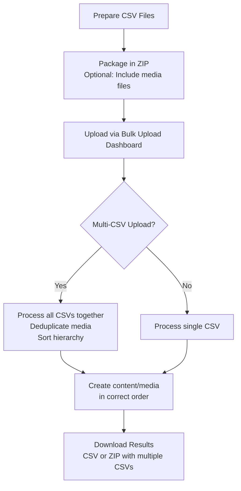

# BulkUpload for Umbraco

[](https://www.nuget.org/packages/Umbraco.Community.BulkUpload/)
[](https://www.nuget.org/packages/Umbraco.Community.BulkUpload)
[](LICENSE)
[](https://marketplace.umbraco.com/package/umbraco.community.bulkupload)

A powerful Umbraco package for importing large volumes of content and media using CSV files. Perfect for migrations, bulk updates, and data onboarding.

**Now supports both Umbraco 13 and Umbraco 17** through a single multi-targeted package.

## Features

✨ **Content & Media Import** - Upload CSV files or ZIP files (CSV + media) to create or update content nodes and media items
🔄 **Create & Update Modes** - Create new items or update existing ones by GUID with partial property updates
📦 **Multi-CSV Support** - Import multiple CSV files in a single ZIP with automatic deduplication and cross-file hierarchy
🔗 **Legacy Hierarchy Mapping** - Preserve parent-child relationships from legacy CMS systems
🎨 **Flexible Media Sources** - Import from ZIP files, file paths, or URLs
🔧 **Extensible Resolvers** - Create custom data transformers for any property type
📊 **Export Results** - Download detailed CSV reports of imported items
⚡ **Block List Support** - Handle complex content types including Block Lists and Block Grids
🌍 **Multi-Version Support** - Single package for Umbraco 13 (net8.0) and Umbraco 17 (net10.0)

## Quick Start

### Installation

Install via NuGet:

```bash
dotnet add package Umbraco.Community.BulkUpload
```

Or via the [Umbraco Marketplace](https://marketplace.umbraco.com/package/umbraco.community.bulkupload).

### Quick Test Setup

Want to try it out quickly? This script creates a new Umbraco site with the Clean Starter Kit and BulkUpload pre-installed:

```bash
# Install Umbraco templates
dotnet new install Umbraco.Templates --force

# Create solution and project
dotnet new sln --name "MySolution"
dotnet new umbraco --force -n "MyProject" \
  --friendly-name "Administrator" \
  --email "admin@example.com" \
  --password "1234567890" \
  --development-database-type SQLite

dotnet sln add "MyProject"

# Add Clean Starter Kit and BulkUpload
dotnet add "MyProject" package clean
dotnet add "MyProject" package Umbraco.Community.BulkUpload

# Run the site
dotnet run --project "MyProject"
```

Then:
1. Navigate to the Umbraco backoffice at `https://localhost:44362/umbraco` (check console for actual port)
2. Go to **Users** section → **Administrator Group** → Add **Bulk Upload** section permission
3. Refresh the page and you'll see the **Bulk Upload** section in the sidebar

### Sample Data

Download our sample CSV files to quickly test the package:

#### Content Import Samples
- [📄 Basic Content Sample](https://github.com/ClerksWell-Ltd/BulkUpload/blob/main/samples/bulk-upload-sample.csv?raw=true) - Article import with various property types
- [🔄 Content Update Sample](https://github.com/ClerksWell-Ltd/BulkUpload/blob/main/samples/content-update-sample.csv?raw=true) - Update existing content by GUID

#### Media Import Samples
- [🖼️ Media with ZIP](https://github.com/ClerksWell-Ltd/BulkUpload/blob/main/samples/bulk-upload-media-sample.csv?raw=true) - For importing media files from a ZIP
- [🌐 Media from URLs](https://github.com/ClerksWell-Ltd/BulkUpload/blob/main/samples/bulk-upload-media-url-sample.csv?raw=true) - For downloading media from URLs
- [🔄 Media Update Sample](https://github.com/ClerksWell-Ltd/BulkUpload/blob/main/samples/media-update-sample.csv?raw=true) - Update existing media by GUID

For more examples, explore the [samples directory](samples/).

## How It Works



### Key Workflows

1. **Create & Update Modes** - Create new content/media or update existing items by GUID
2. **Media Preprocessing** - All media references are gathered from all CSVs and deduplicated
3. **Hierarchy Sorting** - Parent-child relationships work across CSV files using topological sort
4. **Legacy ID Mapping** - Cross-file parent references using `bulkUploadLegacyParentId`
5. **Result Export** - Single CSV for one file, ZIP with separate CSVs for multi-file imports

## Usage

### Content Import

Import content with or without media:

**CSV Format:**
```csv
parentId,docTypeAlias,name,title,heroImage|zipFileToMedia,publishDate|dateTime
1100,productPage,Red Widget,Amazing Red Widget,hero-red.jpg,2024-01-15
1100,productPage,Blue Widget,Fantastic Blue Widget,hero-blue.jpg,2024-01-16
```

**Upload Options:**
- **CSV only** - For content without media or using URL/path media references
- **ZIP file** - Package CSV + media files together

See the [Package README](.github/README.md#content-import) for detailed instructions.

### Update Mode

Update existing content or media items using their GUIDs:

**Content Update CSV:**
```csv
bulkUploadShouldUpdate,bulkUploadContentGuid,parent,name,title,description|text
true,a1b2c3d4-e5f6-7890-abcd-ef1234567890,1100,My Article,Updated Title,New content
```

**Media Update CSV:**
```csv
bulkUploadShouldUpdate,bulkUploadMediaGuid,parent,name,altText|text
true,d4e5f6a7-b8c9-0123-def0-123456789abc,1150,Logo,Updated alt text
```

**Key Points:**
- Set `bulkUploadShouldUpdate=true` to enable update mode
- Use `bulkUploadContentGuid` or `bulkUploadMediaGuid` to identify items
- Only specified properties will be updated (partial updates supported)
- Export results from create operations to get GUIDs for updates

See [Update Mode Samples](samples/README.md#update-mode-samples) for examples.

### Media Import

Import media from ZIP files, file paths, or URLs:

**CSV Format with Flexible Sources:**
```csv
fileName,mediaSource|pathToStream,mediaSource|urlToStream,parent,name,altText
logo.png,,,/Brand/Logos/,Company Logo,Our logo
,C:/Assets/banner.jpg,,1150,Homepage Banner,Banner image
,,https://cdn.example.com/hero.jpg,/Marketing/,Hero Image,Hero banner
```

**Parent Folder Options:**
- Integer ID: `1150`
- GUID: `a1b2c3d4-e5f6-7890-abcd-ef1234567890`
- Path: `/Products/Images/` (auto-creates folders)

See the [Media Import Guide](.github/docs/user-guides/media-import-guide.md) for detailed instructions.

### Custom Resolvers

BulkUpload is built on an extensible resolver system. Create custom resolvers to transform CSV values:

```csharp
using Umbraco.Community.BulkUpload.Resolvers;

public class UpperCaseResolver : IResolver
{
    public string Alias() => "uppercase";

    public object Resolve(object value)
    {
        return value?.ToString()?.ToUpper() ?? string.Empty;
    }
}
```

Register your resolver:

```csharp
public class MyComposer : IComposer
{
    public void Compose(IUmbracoBuilder builder)
    {
        builder.Services.AddSingleton<IResolver, UpperCaseResolver>();
    }
}
```

Use it in your CSV:
```csv
name,title|uppercase
John Doe,software engineer
```

See the [Custom Resolvers Guide](.github/docs/custom-resolvers-guide.md) for more details and examples.

## Documentation

### User Guides
- [📘 Installation & Setup](.github/README.md#installation) - Getting started guide
- [🔄 Update Mode Guide](.github/docs/user-guides/UPDATE_MODE_GUIDE.md) - Update existing content and media by GUID
- [📸 Media Import Guide](.github/docs/user-guides/media-import-guide.md) - Comprehensive media import documentation
- [🔗 Legacy Hierarchy Mapping](.github/docs/user-guides/LEGACY_HIERARCHY_MAPPING.md) - Preserve CMS hierarchies during migration
- [📝 Content Picker Legacy IDs](.github/docs/user-guides/CONTENT_PICKER_LEGACY_IDS.md) - Handle legacy content pickers

### Developer Guides
- [🔧 Custom Resolvers Guide](.github/docs/custom-resolvers-guide.md) - Create custom data transformers
- [🌿 Branching Strategy](.github/docs/developer-guides/BRANCHING_STRATEGY.md) - Main-branch workflow with multi-targeting (v2.0.0+)
- [⚡ Multi-Targeting Quick Start](.github/docs/developer-guides/MULTI_TARGETING_QUICK_START.md) - Essential commands and workflows
- [🔄 Release Process](.github/docs/developer-guides/RELEASE_PROCESS.md) - Release workflow and checklist
- [📊 Workflow Diagrams](.github/docs/developer-guides/WORKFLOW_DIAGRAM.md) - Visual development workflows

### Additional Resources
- [🤝 Contributing Guidelines](.github/CONTRIBUTING.md) - How to contribute
- [📋 Changelog](CHANGELOG.md) - Version history and release notes
- [❓ Troubleshooting](.github/docs/troubleshooting.md) - Common issues and solutions
- [📂 Sample Files](samples/) - Example CSV templates

## Architecture

BulkUpload v2.0.0+ uses **multi-targeting** to support both Umbraco 13 and 17 from a single codebase:

- **Single Package** - One NuGet package for both versions
- **Conditional Compilation** - Framework-specific code where needed
- **Dual Frontend** - AngularJS for V13, Lit web components for V17
- **Service Layer** - Shared business logic across both versions

Learn more in the [Multi-Targeting Quick Start](.github/docs/developer-guides/MULTI_TARGETING_QUICK_START.md) and [Branching Strategy](.github/docs/developer-guides/BRANCHING_STRATEGY.md).

## Contributing

We welcome contributions! Please see our [Contributing Guidelines](.github/CONTRIBUTING.md) for details on:

- Development setup
- Coding standards
- Pull request process
- Testing requirements

## Support

- 📖 [Documentation Index](.github/docs/README.md)
- 🐛 [Report Issues](https://github.com/ClerksWell-Ltd/BulkUpload/issues)
- 💬 [Discussions](https://github.com/ClerksWell-Ltd/BulkUpload/discussions)
- 📦 [NuGet Package](https://www.nuget.org/packages/Umbraco.Community.BulkUpload)
- 🏪 [Umbraco Marketplace](https://marketplace.umbraco.com/package/umbraco.community.bulkupload)

## License

MIT © ClerksWell Ltd

This project is licensed under the [MIT License](LICENSE).

### Third-Party Dependencies

**CsvHelper** by Josh Close
Dual licensed under [Apache License 2.0](https://opensource.org/license/apache-2-0) or [Microsoft Public License (MS-PL)](https://opensource.org/license/ms-pl-html)

## Authors

- **Paul Seal** - [CodeShare.co.uk](https://codeshare.co.uk)
- **ClerksWell Ltd** - [ClerksWell.com](https://clerkswell.com)

---

⭐ If you find this package useful, please consider giving it a star on GitHub!
